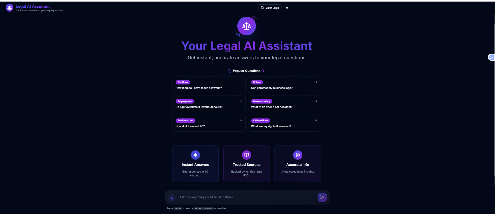
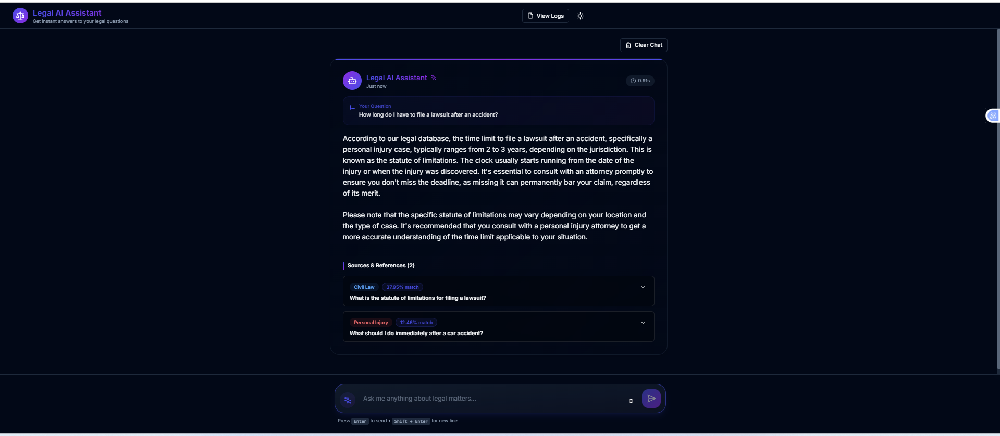
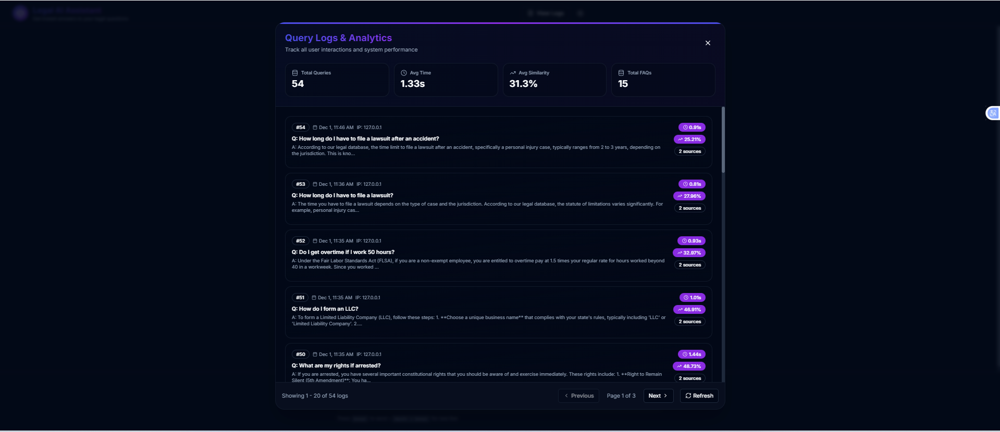

# Legal AI Assistant – Full Stack RAG Chatbot

<p align="center">
  
  
  
  
  
  
  
  
  
</p>

A production-ready AI-powered legal question answering chatbot built with **Django (Backend)** + **React (Frontend)** using **Retrieval-Augmented Generation (RAG)**.

This README gives a complete overview of the project, setup steps, architecture, and usage so that anyone—developer can understand and run the system.

## Project Overview

This project is a **Legal Question Answering Chatbot** designed for full‑stack evaluation.  
Users can type any legal question, and the system:

1. Retrieves the most relevant legal FAQs using **semantic search** (ChromaDB)
2. Builds context using the top FAQs
3. Generates an accurate answer using **ChatGroq (Llama‑3.1‑70B)**
4. Displays the result in a modern **React UI**
5. Logs every query for later review

It demonstrates a clean, modular, production-ready RAG‑based architecture.

## Why This Project?

Legal information is often scattered and hard to interpret. This system solves that by:

- Centralizing legal FAQs  
- Using AI to interpret questions  
- Giving accurate, contextual responses  
- Providing citations for transparency  

Perfect for showcasing **Full Stack + AI + RAG** engineering skills.

# Tech Stack

## Backend (Django)
- Django 4.2  
- Django REST Framework  
- ChromaDB (Vector DB)  
- Sentence Transformers (Embeddings)  
- Groq LLM (Llama‑3.1‑70B)  
- SQLite  

## Frontend (React)
- React 18 + Vite  
- TailwindCSS  
- shadcn/ui  
- Axios  
- Framer Motion  

# Project Structure

```
legal-qa-chatbot/
│
├── backend/
│   ├── legal_qa/
│   │   ├── __init__.py
│   │   ├── settings.py            Django config
│   │   ├── urls.py                Main routing
│   │   ├── wsgi.py
│   │   └── asgi.py
│   │
│   ├── api/
│   │   ├── __init__.py
│   │   ├── apps.py
│   │   ├── models.py              FAQ & QueryLog
│   │   ├── views.py               3 API endpoints
│   │   ├── urls.py                API routing
│   │   ├── rag.py                 RAG SYSTEM (core!)
│   │   ├── admin.py
│   │   ├── tests.py
│   │   └── migrations/
│   │       └── __init__.py
│   │
│   ├── data/
│   │   ├── legal_faqs.json        15 FAQs
│   │   └── load_faqs.py           Data loader
│   │
│   ├── chroma_db/                (generated)
│   ├── manage.py
│   ├── requirements.txt           Dependencies
│   ├── .env                       Config
│   ├── .env.example
│   ├── db.sqlite3                (generated)
│
├── frontend/
│   ├── src/
│   │   ├── components/
│   │   │   ├── ui/
│   │   │   │   ├── button.jsx     
│   │   │   │   ├── card.jsx
│   │   │   │   ├── badge.jsx
│   │   │   │   └── scroll-area.jsx
│   │   │   ├── ChatInterface.jsx       Main chat
│   │   │   ├── MessageBubble.jsx       Messages
│   │   │   ├── SourceCard.jsx          Sources
│   │   │   ├── InputArea.jsx           Input
│   │   │   ├── LoadingSkeleton.jsx     Loading
│   │   │   ├── WelcomeScreen.jsx       Welcome
│   │   │   ├── Header.jsx              Header
│   │   │   └── ThemeToggle.jsx         Theme
│   │   │
│   │   ├── services/
│   │   │   └── api.js                 API client
│   │   │
│   │   ├── context/
│   │   │   └── ThemeContext.jsx       Theme state
│   │   │
│   │   ├── hooks/
│   │   │   ├── useChat.js             Chat logic
│   │   │   └── useLocalStorage.js     Persistence
│   │   │
│   │   ├── lib/
│   │   │   └── utils.js               Utilities
│   │   │
│   │   ├── App.jsx                    Main app
│   │   ├── main.jsx                   Entry point
│   │   └── index.css                  Global styles
│   │
│   ├── public/
│   ├── index.html
│   ├── package.json                   Dependencies
│   ├── vite.config.js                 Vite config
│   ├── tailwind.config.js             Tailwind config
│   ├── postcss.config.js
│   ├── .env                           Config
│   ├── .env.example
│                     
│
└── README.md                     
```

---


##  Screenshots

###  Home Screen


###  Chat Interface


###  Query Logs & Analytics


# Installation & Setup

---

##  Backend Setup (Django)

```bash
cd backend
python -m venv venv
source venv/bin/activate  # Windows: venv\Scripts\activate

pip install -r requirements.txt
```
### Run database migrations
```bash
python manage.py makemigrations
python manage.py migrate
```

### Load FAQ data (both DB + ChromaDB)
```bash
python data/load_faqs.py
```

### Start server
```bash
python manage.py runserver
```

Backend runs on:
```
http://localhost:8000
```

---

## Frontend Setup (React)

```bash
cd frontend
npm install
echo "VITE_API_URL=http://localhost:8000/api" > .env
npm run dev
```

Frontend runs on:
```
http://localhost:5173
```

---

# 🔌 API Endpoints

### **POST /api/ask/**
Ask a legal question.

```json
{
  "question": "How long do I have to file a lawsuit?"
}
```

### **GET /api/health/**
Check system health.

### **GET /api/stats/**
Returns total FAQs, queries, ChromaDB count.

---

#  RAG Architecture

```
User → React UI → Django API → RAG Pipeline
       │             │
       │             ├── Embedding (sentence-transformers)
       │             ├── Vector Search (ChromaDB)
       │             ├── Context Builder
       │             └── LLM Response (Groq)
       │
       └── Answer + Sources → UI
```

--- 

### Features Showcase
- Message bubbles with avatars
- Source cards with similarity scores
- Category badges (color-coded)
- Typing indicators
- Welcome screen with example questions
- Smooth animations

## Example Queries

Try these questions:

1. "How long do I have to file a lawsuit?"
2. "Can I protect my business logo?"
3. "Do I get overtime if I work 50 hours?"
4. "What should I do after a car accident?"
5. "Can my employer fire me without reason?"
6. "How is child custody determined?"
7. "What's the difference between copyright and patent?"
8. "What are my rights if I'm arrested?"
9. "How do I form an LLC?"
10. "What makes a contract legally binding?"

## Performance

- **Response Time**: 1-3 seconds
- **Embedding Generation**: ~50ms
- **Vector Search**: ~10ms
- **LLM Generation**: 1-2 seconds
- **Accuracy**: High (based on quality FAQs)

---

#  Testing

### API Testing (curl)

```bash
curl -X POST http://localhost:8000/api/ask/   -H "Content-Type: application/json"   -d '{"question": "How do I file for a trademark?"}'
```

### Test RAG directly
```bash
python -c "from api import rag; print(rag.process_question('What is overtime pay?'))"
```

---

**Recommended:**
- Deploy to: Heroku, Railway, DigitalOcean
- Use PostgreSQL instead of SQLite
- Set DEBUG=False
- Configure ALLOWED_HOSTS
- Use environment variables

### Frontend (Production)

```bash
# Build
npm run build

# Deploy dist/ folder to:
# - Vercel (recommended)
# - Netlify
# - GitHub Pages
# - AWS S3 + CloudFront
```

## Limitations

- FAQ database limited to 15 entries (easily expandable)
- Groq free tier has rate limits
- No user authentication (can be added)
- English only (can be extended)
- Local deployment required for full control

## Future Enhancements

- [ ] User authentication & sessions
- [ ] More FAQs (100+)
- [ ] Multi-language support
- [ ] Voice input/output
- [ ] PDF document upload & parsing
- [ ] Admin panel for FAQ management
- [ ] Analytics dashboard
- [ ] Email notifications
- [ ] Mobile app (React Native)
 

 ## Acknowledgments

- **ChromaDB** - Vector database
- **Sentence Transformers** - Embeddings
- **Groq** - Fast LLM inference
- **shadcn/ui** - Beautiful components
- **Tailwind CSS** - Styling
- **Django** - Backend framework

---
#  Author : 
# Sushma A
---

